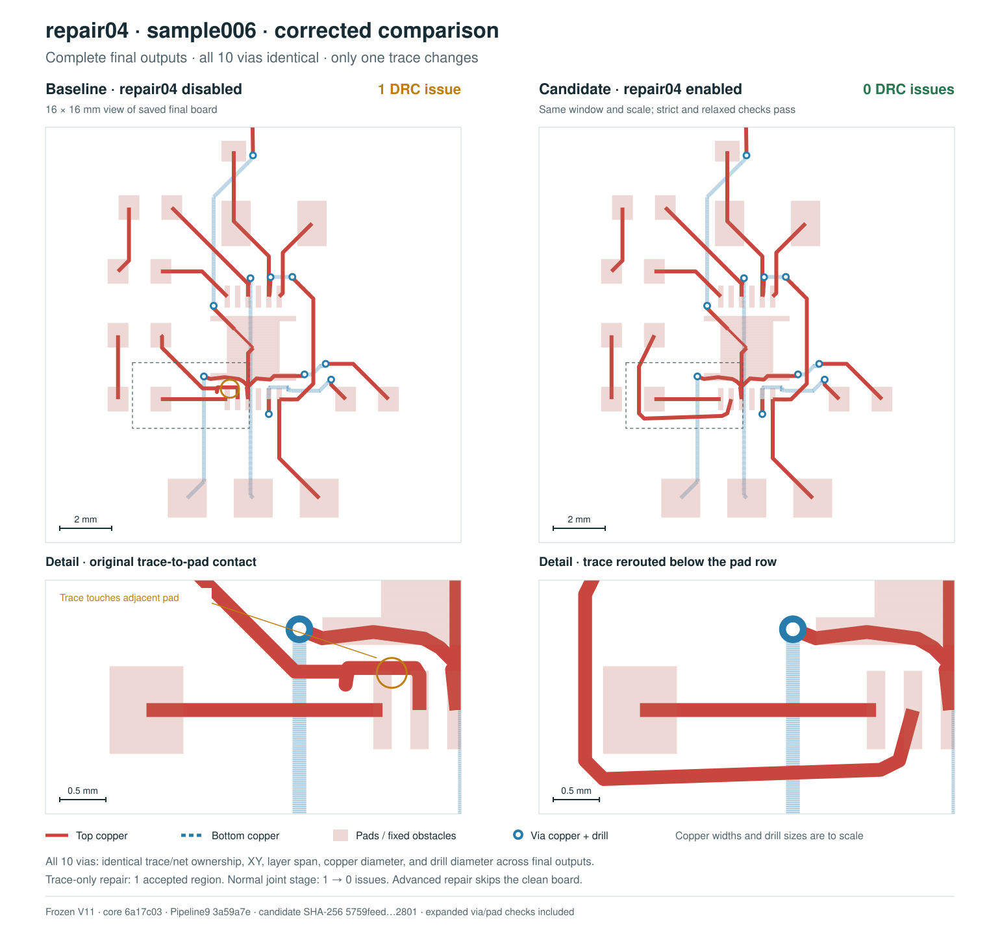

# repair04: bounded SRJ repair and Pipeline9 benchmark

The repair04 integration, including its downstream joint-proposal acceptance guard, changes the complete current published SRJ33 dataset from **0/15 to 5/15 boards passing final default DRC (+33.33 percentage points)**. On the older complete 37-board revision, it changes **0/37 to 8/37 (+21.62 percentage points)**. Both default and relaxed checks are evaluated after joint repair, length matching, and power expansion. Newly passing current boards under default DRC: sample006, sample048, sample049, sample054, sample056.

The baseline has zero passing boards, so a relative percentage increase is undefined; a +30% relative improvement cannot be established from that baseline. The result reaches the 30-percentage-point interpretation of the requested target. This is a comparison of the complete integration against the baseline; it does not isolate repair04 from the joint-stage guard in a separate ablation.

- Solver: [tscircuit/repair04](https://github.com/tscircuit/repair04), code commit `a284c44ff77a6ad30131fb8c78e8663ae54f4bf6`.
- Pipeline9 integration: [tscircuit-autorouter PR #2420](https://github.com/tscircuit/tscircuit-autorouter/pull/2420), benchmark source commit `5b16c81e50b8f9302233a16079f95d434ade9830`.
- Repository creation: [create-repo PR #70](https://github.com/tscircuit/create-repo/pull/70), following [the handbook bootstrap guide](https://github.com/tscircuit/handbook/blob/main/guides/bootstrapping-repos.md).

## Complete dataset results

| Dataset | Baseline passing | Candidate passing | Change |
|---|---:|---:|---:|
| Current published SRJ33, default DRC (15 boards) | 0/15 | 5/15 | +33.33 pp |
| Current published SRJ33, relaxed DRC (15 boards) | 0/15 | 5/15 | +33.33 pp |
| Autorouter-pinned SRJ33, default DRC (37 boards) | 0/37 | 8/37 | +21.62 pp |
| Autorouter-pinned SRJ33, relaxed DRC (37 boards) | 0/37 | 8/37 | +21.62 pp |

The current revision is [`026a78cb005ab33dde24f2db8fefbfd8d8efa614`](https://github.com/tscircuit/dataset-srj33-drc-failures/tree/026a78cb005ab33dde24f2db8fefbfd8d8efa614), whose commit is dated September 5, 2026 at 19:34:04 UTC. All 15 published inputs are included. This later dataset revision was discovered while working; the benchmark uses its entire membership rather than selecting by repair04 outcome. Original input-file hashes match the corresponding inputs in the complete older revision [`f566b62be0f83395d9ab63ddc068f9d645b68b16`](https://github.com/tscircuit/dataset-srj33-drc-failures/tree/f566b62be0f83395d9ab63ddc068f9d645b68b16).

The dataset's separate [authenticity audit](https://github.com/tscircuit/dataset-srj33-drc-failures/blob/026a78cb005ab33dde24f2db8fefbfd8d8efa614/audit/authenticity-selection.json), using router `934cfed20151661b6ce1aa00827b1fc1e69ce28c`, retained 15 cases, classified 16 as DRC-passed, and excluded six with unconfirmed error evidence: sample004, sample010, sample020, sample025, sample032, sample052. These audit labels come from that separate router/conversion run, not this benchmark's baseline. Unconfirmed errors do not establish that a board or every reported issue is invalid. All 37 cases remain in the older-denominator result, and their audit labels are preserved in the CSV.

| Current board | Baseline default errors | Final default errors | Baseline relaxed errors | Final relaxed errors |
|---|---:|---:|---:|---:|
| sample002 | 4 | 1 | 4 | 1 |
| sample003 | 20 | not solved | 20 | not solved |
| sample005 | 79 | 1 | 79 | 1 |
| sample006 | 1 | 0 | 1 | 0 |
| sample044 | 26 | 5 | 26 | 5 |
| sample045 | 60 | not solved | 60 | not solved |
| sample046 | 23 | 4 | 23 | 4 |
| sample048 | 17 | 0 | 17 | 0 |
| sample049 | 6 | 0 | 6 | 0 |
| sample050 | 8 | 5 | 8 | 5 |
| sample051 | 2 | 2 | 2 | 2 |
| sample053 | 42 | 1 | 42 | 1 |
| sample054 | 5 | 0 | 5 | 0 |
| sample055 | 35 | 32 | 35 | 32 |
| sample056 | 3 | 0 | 3 | 0 |

Across all 37 boards, baseline/candidate completed counts are 37/35; timeout counts are 0/2. Every input remains in the denominator, and an unsolved or unvalidated candidate cannot pass. Unsolved candidates: sample003, sample045. Candidates without a validated replay: None. Pass-to-fail regressions: 0. Final default error-count regressions: sample036 (3→4). Null counts mean unavailable, not zero. Full per-board values are in `repair04-srj33-boards.csv` and the two JSON comparisons.

The summaries call the default `getDrcErrors` result `strictDrc`; the relaxed evaluator supplies 0.1 mm trace and via clearance. Both use the existing Circuit JSON conversion and checks. The stage-specific reference count in the CSV is diagnostic; passing status always uses the final full output.

## Bounded solver contract

Pipeline9 inserts repair04 immediately after `globalDrcForceImproveSolver` (repair03) and before `pipeline9JointDrcRepairSolver`. The child solver receives a cropped SRJ, clipped route fragments, explicit bounds, a boundary margin, and locked-point masks. Full-board state and merge provenance remain with the parent.

Regions begin at 10×10 mm and may expand to 16×16 or 24×24 mm. Original endpoints, boundary cut points and collars, ports, required electrical contacts, variable widths, and fixed copper remain protected. Vias move as complete layer transitions. A bounded A* search and local bend/bridge candidates preserve existing copper dimensions. Merge validation rejects stale state and unauthorized geometry or metadata changes. The parent accepts a region only after independent full-board DRC validation and obstacle checks.



The illustrated first production-selected region is 10×10 mm with a 0.5 mm fixed collar. Its local score changes from two errors to zero with all 41 locked points unchanged. The complete-board benchmark counts above are evaluated separately.

The integration also validates the final joint-repair proposal against its input at the existing final DRC thresholds. It retains the accepted input when a valid optimization proposal increases the error count, and records the rejection. Solver errors still surface. This protects sample049's zero-error repair04 output from a later joint-repair regression; actual length matching and power expansion still run.

## Validation and runtime limits

The repair04 repository passes 35 tests covering cropped inputs, exact boundary and endpoint preservation, junctions, widths, vias, generic obstacles, and malformed state. Focused Pipeline9 integration and joint-acceptance tests, full TypeScript checking, and the JavaScript/declaration build pass.

A separate full-default Game Boy fixture passes all ten routing, ownership, and snapshot assertions in approximately 821 seconds locally; that fixture does not assert zero DRC errors. Its historical CI ownership regression keeps repair04 disabled and preserves the original snapshot. Default-enabled Pipeline9 DRC tests and this complete SRJ33 benchmark cover the new stage. Dense boards can still require many minutes: the default parent budget is 32 regions with up to 8,000 candidates each. Search speed remains a limitation.

## Reproduction and provenance

The baseline completes the full real Pipeline9 with `enableRepair04: false`. Candidate runs restore the captured state immediately after repair03 and execute every remaining real stage. Before attempting a candidate, each board must pass a disabled replay identity gate. Here, 37/37 gates pass with identical DRC counts and structure/metadata; 37/37 outputs are byte-exact with the full baseline. The gate permits numeric differences no larger than 1e-12 mm and records the maximum difference separately. Failed or timed-out gates produce nonpassing results. The disabled control also disables the new joint-proposal acceptance check. The checker, conversion, effort, inputs, and copper dimensions are unchanged between controls.

Runs use Bun `1.4.2` on `linux/arm64`, effort `1`, a 30-minute limit for each disabled or candidate replay process, and at most two concurrent workers per four-CPU Blacksmith VM. The full baseline has its own 30-minute limit; replay is a conditional downstream comparison and is not evidence that every full candidate solve completes within the same end-to-end wall-clock budget. All batches use the same frozen bundle and complete baseline fingerprint. Package inventories and the frozen bundle are archived; no dependency lockfile existed in the source environment. Candidate timings cover only replay after repair03 and are not a speed comparison with full baseline timings.

CSV `originalInputFileSha256` is the raw published file hash. `preparedInputSha256` (called `inputSha256` in comparison JSON) hashes the serialized input after the existing legacy-metadata migration. They are intentionally different representations. `repair04-srj33-provenance.json` records the configuration, verified source manifest, and input report-file hashes. The downloaded manifests and independent selection are also included.

CSV timings are blank for unsolved runs. The raw comparison JSON retains the runner's zero-valued failure placeholder for those elapsed-time fields; it does not mean a timeout took zero time. Raw candidate records separately retain `validationAndReplayElapsedTimeMs`.

All eight passing saved outputs independently reproduce zero default and relaxed errors without rerouting. The accompanying `repair04-passing-outputs.tar.gz` contains their exact final bytes, minimal original DRC contexts, and a hash manifest. From this PR checkout after installing dependencies:

```sh
mkdir -p work/repair04-saved-output-check
tar -xzf docs/benchmarks/repair04/repair04-passing-outputs.tar.gz -C work/repair04-saved-output-check
bun scripts/benchmark/verify-repair04-saved-outputs.ts work/repair04-saved-output-check/repair04-passing-outputs
```

This small archive verifies passing examples only; the complete comparisons retain all failures. The full 517-file raw evidence archive is delivered separately as `repair04-v8-evidence.tar.gz` (SHA-256 `01740d75f4f725c47c851e5838634c31a2d91ec84cc91511e19309bd739b0ff9`), with baseline outputs, checkpoints, all six candidate cohorts, manifests, frozen code, and an internal checksum list.

- Frozen replay bundle SHA-256: `19371644175eadbd80bb21fd6b4cdfce0f06f12560d442790ff5b88417985f8d`.
- Frozen replay runner SHA-256: `a2276626ac803ab39b4c22276b76e0b72cabb1eafb12b85dcf6f0732a7046ae4`.
- Complete baseline fingerprint SHA-256: `0aa848c4df6139cd46e9780f507f13bea7a96caca415f2f5197569e36860dd89`.
- Baseline router base revision: `ba756a5ae2cf4c9a8c11bce21666a28362927e94`.
- Comparison and provenance tooling commit: `0966fc774d9ba7d27205daab04f43b67af2e767a`. Its archived source hashes are separate from the frozen execution bundle's source hashes.
- Reproduction commands and identity-gate details: [scripts/benchmark/repair04-srj33.md](https://github.com/tscircuit/tscircuit-autorouter/blob/0966fc774d9ba7d27205daab04f43b67af2e767a/scripts/benchmark/repair04-srj33.md).

The SRJ33 cases were used during solver development and tuning; this is a development benchmark, not a held-out estimate of generalization. The result is specific to these recorded revisions and budgets. It does not imply that all boards are repaired or that regional zero-error results alone constitute a final passing board.
