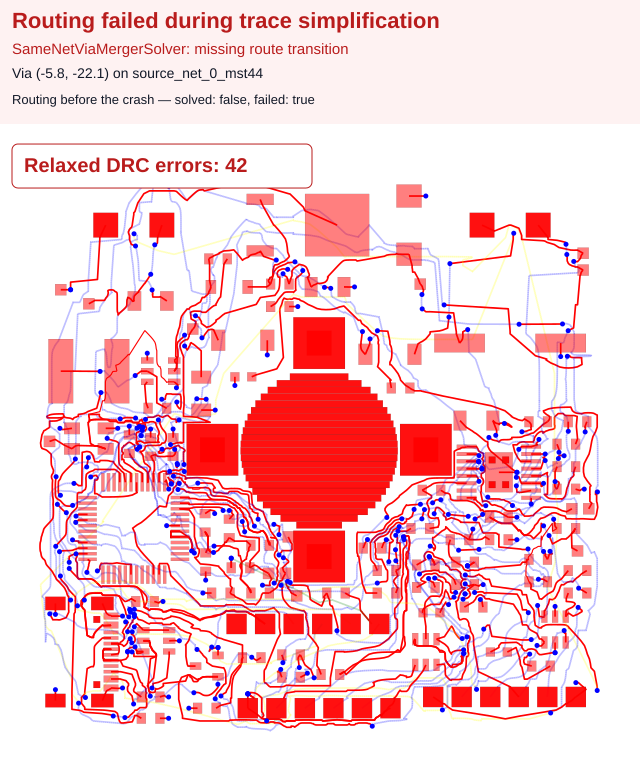
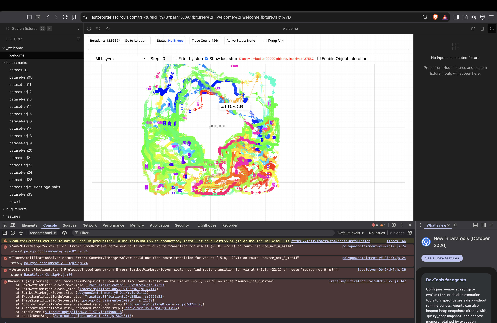

# Board #1017: missing route transition during same-net via merging

## Reported behavior

Running the attached board through Pipeline 9 in the autorouter playground throws:

```text
SameNetViaMergerSolver could not find route transition for via at (-5.8, -22.1) on route "source_net_0_mst44"
```

The console propagates this error through `TraceSimplificationSolver` and
`AutoroutingPipelineSolver9_PreloadedTraceGraph`, followed by an uncaught promise
rejection. At the time of the supplied screenshot, the debugger displays
1,329,674 iterations, 196 traces, `Status: No Errors`, and `Active Stage: None`.
The exact deployed revision and debugger settings were not included in the report.

Expected behavior: complete routing without a missing-transition exception. If
routing fails, the debugger should display the failure rather than `No Errors`.

## Input and reproduction

`bugreport109-board-1017-via-transition.srj.json` is an unchanged copy of the supplied
`_board#1017 __-autorouting.json`: a 50 × 50 mm, four-layer board with 311 obstacles,
52 connections, and no pre-routed traces. Blind and buried vias are disabled.

1. Install dependencies with `bun install` and run `bun run start`.
2. Open `bug-reports/bugreport109-board-1017-via-transition` in Cosmos.
3. Run the solver through trace simplification. The fixture selects Pipeline 9
   explicitly and disables caching so the board is routed from scratch.
4. Inspect the debugger status and browser console for the error above.

This report preserves the original input and screenshot; it does not change
solver behavior.

## Confirmed reproduction

The exact exception also reproduces locally on `main` at `34dc48b` (v0.0.938),
with caching disabled. The pipeline stops in `traceSimplificationSolver` after
1,330,294 iterations with `failed: true` and `solved: false`.

Run the failure-characterization test and its SVG snapshot with:

```sh
bun test tests/bugs/bugreport109-board-1017-via-transition.test.ts --timeout 9999999
```

The test asserts this exact exception and snapshots `solver.visualize()` after
the crash, using the solver's default visualization. This preserves the
active via-merger solver's routes, vias, and obstacles rather than reconstructing
an output board. A red banner identifies the failed stage, missing via transition,
and `solved: false, failed: true` status. The snapshot has no DRC summary because
this is the solver's debug view at the failure, not a completed routing result.
Linux and macOS use separate snapshots, following existing bug-report tests,
because native routing produces small coordinate differences across platforms.
When the bug is fixed, replace the failure assertions with
successful-routing assertions and regenerate the snapshot.



## Original failure snapshot


