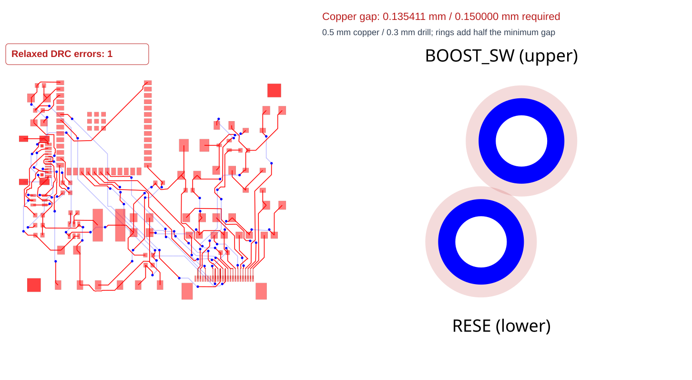
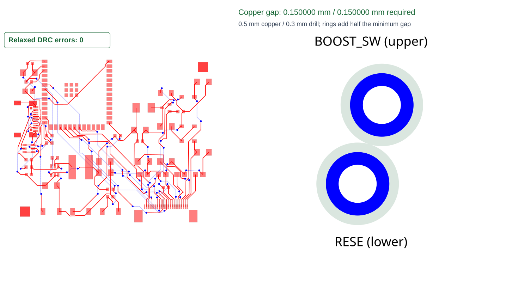

# Muse e-paper: via copper clearance regression

Issue: https://github.com/tscircuit/tscircuit-autorouter/issues/2822

The captured SRJ is the default local main-routing input from a 55 × 46 mm,
two-layer ESP32-S3 / GDEY075T7 board after 20 saved FPC escapes. The escapes
are represented in the input's obstacles and connection endpoints. It has
32 connections and 232 obstacles. No Muse source, component imports, CLI
routing artifacts, custom correction, or copper-pour solver is needed.

## Run the regression

From the repository root after `bun install`:

```sh
bun test tests/repro/pipeline9-muse-eink-via-copper-clearance.test.ts --timeout 9999999
```

The test requires a solved output with zero reference DRC errors, then
independently measures every different-net via pair's copper gap. Shared
endpoints of branches on one net are counted once. Every emitted via must
retain its 0.3 mm drill and 0.5 mm copper diameter. The test has no expected
failure, skipped assertion, or environment switch.

The sibling `.fixture.tsx` loads this SRJ in the existing Cosmos pipeline
debugger with cache disabled and effort 1.

## Visual comparison

Both test-generated snapshots use the same board overview, physical via
magnification and current reference checker with the board's declared rules.
The right-hand rings add half the required copper clearance to each via:
they overlap in the original output and touch in the fixed output.

Original output: **1 DRC error**, copper gap **0.135411 mm**.



Fixed output: **0 DRC errors**, copper gap **0.150000 mm**.



The original snapshot test reads `muse-eink-via-copper-clearance.original-output.json`,
freshly captured from unmodified published capacity-autorouter 0.0.953 with
cache disabled and effort 1. This preserves the bad geometry independently
of future solver changes. Its SHA-256 is `60eebc59ef08ffd22801a90403f35cb35cc6a144d73990a3920ac4e11e60f587`.
The fixed regression freshly solves the identical SRJ with cache disabled
and effort 1. Neither result is adjusted after routing. The hard assertions
check the measured gaps and DRC; the SVG assertions preserve the visuals.
The selected coordinates in the rendering helper only locate the reported
pair for magnification and never change the solver or clearance assertions.

Regenerate only these snapshots with:

```sh
BUN_UPDATE_SNAPSHOTS=1 bun test tests/repro/pipeline9-muse-eink-original-output.test.ts tests/repro/pipeline9-muse-eink-via-copper-clearance.test.ts --timeout 9999999
```

## Original failure and root cause

On the original base `4fb900bb6f553b2f8e468f6aed9ee68c2841438e`, the default
Pipeline 9 returned `solved=true`, `failed=false`, 108 traces and 92 physical
vias. The consuming tscircuit build rejected this pair:

| Net | Captured net ID | Via center (mm) |
| --- | --- | --- |
| BOOST_SW | source_net_2 | (16.147295435728953, 11.046851707207189) |
| RESE | source_net_1 | (15.911643654309586, 10.456754126462537) |

The center distance minus the two copper radii is **0.13541082528299198 mm**,
below the **0.15 mm** `minPadEdgeToPadEdgeClearance` requirement. The consuming
build emitted `pcb_via_clearance_error` for `pcb_via_84` / `pcb_via_86` and
exited 1. Its board contains no copper pours.

The input also declares `minViaHoleEdgeToViaHoleEdgeClearance=0.1`. Its
drill-edge gap is about 0.335411 mm and passes that separate hole rule.
The autorouter used checks 0.0.222, whose different-net via checker measured
only drill spacing. In addition, the projection solver used the relaxed
0.1 mm via clearance rather than the declared copper clearance. Updating
the checker alone exposes the violation but leaves the reported pair
unrepaired; the projection must receive the declared pad-edge rule too.

## Fix and validation

- Upgrade `@tscircuit/checks` to ^0.0.233, whose different-net via check also
  measures copper on shared layers.
- Preserve `minPadEdgeToPadEdgeClearance` on the reference DRC board element.
- Use that declared copper rule in reference DRC and clearance projection.
  The drill rule retains its separate relaxed default. The indexed engine's
  search heuristic stays relaxed because it applies a single copper gap to
  both same-net and different-net pairs; the electrical pad rule only applies
  to different nets. Reference DRC validates the declared rules before accepting
  a candidate. Coupled projection retains its existing precision margin.
- No new repair stage, report-specific coordinates, or post-routing correction.
- The full-board test requires zero DRC errors and independently checks gaps.
  Smaller tests use a 0.25 mm pad rule with a distinct 0.05 mm trace rule and
  0.1 mm drill rule; projection preserves terminal copper and input routes.
- Focused solver/DRC tests, library build and TypeScript checking pass locally.
- A complete Muse `tsci build --site` with the locally built fixed solver,
  returning its output unchanged through a CLI adapter, passes all 23 board
  checks with zero circuit DRC errors/warnings. Its main-phase SRJ is
  deep-equal to this captured input. It retains 92 vias with 0.3 mm drills
  and 0.5 mm copper. The closest different-net copper gap is 0.15 mm
  (floating-point representation 0.1499999999999979).

## Provenance

Original build: tscircuit 0.0.2742, core 0.0.2056, CLI 0.1.2235,
capacity-autorouter 0.0.953, default `auto_local`, cache miss.
SRJ SHA-256: `4f06c044632b187971adec7ff12dd79dcd6bc91160927d97a0171fba8b972e85`.
The reproduction-only commit is `341c786e51765f3f4ff9ef8f8278244eedb1758d`.
It includes the original passing characterization test and opt-in failing
assertion; the current test requires the fixed behavior directly.

As a control, removing all saved FPC escapes from the same board without
changing physical placement routes with 101 vias and zero circuit DRC errors.
The failing input is preserved intact here. The published Muse design and
its separate manual correction are not changed by this PR.
