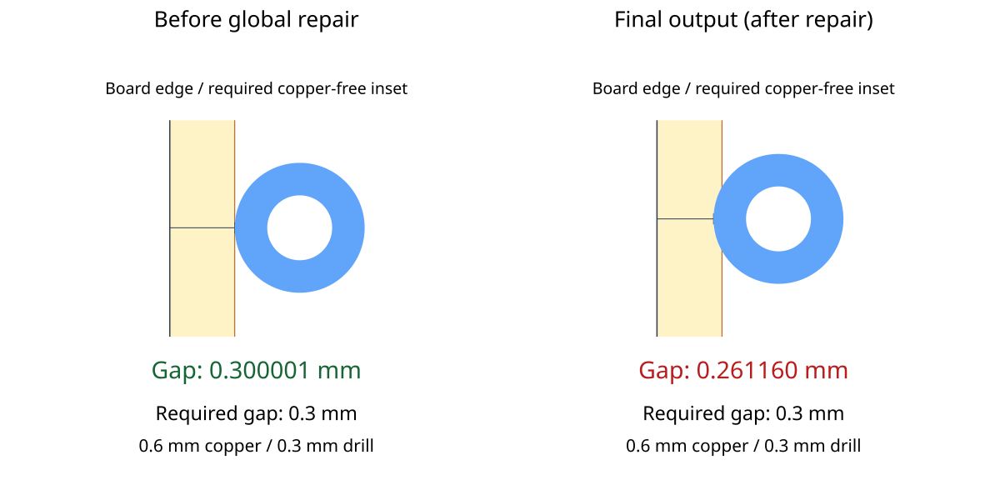
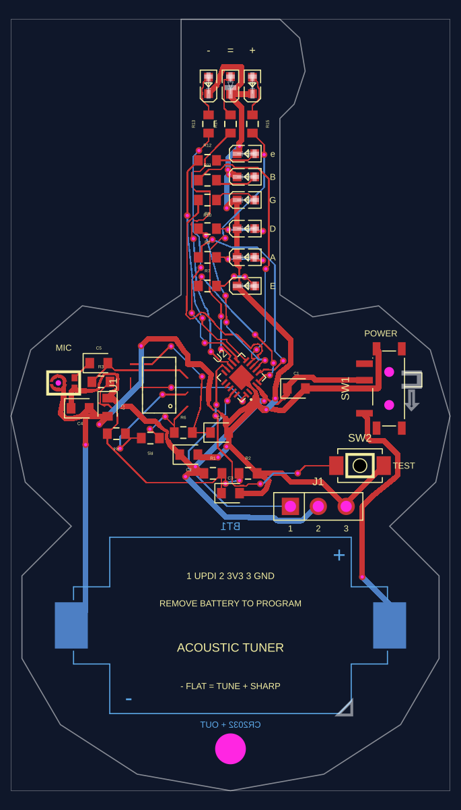

# Pipeline 9 moves a via inside the required board-edge clearance

A fresh Pipeline 9 route of the acoustic guitar tuner requests a **0.3 mm
copper-to-board-edge clearance**, but finishes with a **0.261160 mm** gap at
one via. The via meets the rule immediately before global repair. Global
repair moves it closer to the outline, and the final pipeline output retains
that position.

This is a reproduction only. It does not change routing behavior.

## Input and scope

`input.srj.json` is an unchanged copy of `routing-cache/input.json` from
[gokul/acoustic-guitar-tuner](https://tscircuit.com/gokul/acoustic-guitar-tuner),
version **1.0.10**, release `db07d87c-f403-458a-a9ba-7c2e676651d0`.
Its SHA-256 is
`23952a7290bd26f5d4cf098dfbc41f6a12d801822f9dde226fc3ba624adc136e`.
The complete board input is retained to preserve the original routing conditions;
this is not a minimized input.

The input has two layers, the guitar-shaped outline,
`minBoardEdgeClearance: 0.3`, `minViaPadDiameter: 0.6`, and
`minViaHoleDiameter: 0.3`. The test passes this input directly to
`AutoroutingPipelineSolver9_PreloadedTraceGraph`, disables the routing cache,
and runs every pipeline stage with the default effort.

The published board's custom router reuses saved traces for an exact input
match and otherwise requests an extra **0.6 mm** routing margin. This
reproduction bypasses that adapter and those saved traces. It demonstrates
the fresh router's behavior at the board's declared **0.3 mm** rule; it does
not claim that the published saved layout has this violation.

## Run the reproduction

From the repository root:

```sh
bun install
bun test tests/repro/acoustic-tuner-board-edge-clearance.test.ts tests/repro/acoustic-tuner-rerouted-board.test.ts --timeout 9999999
```

The test prints the before-repair, after-repair, and final via measurements.
It checks that the pipeline finishes successfully, that this via originally
meets the rule, and that exactly one final via violates the rule. It also
checks the before and final positions with
`@tscircuit/checks`'s `checkCopperToBoardEdgeClearance`, using only the board
outline and the via, so unrelated trace metadata cannot cause this result.

**The test passes when it reproduces the current defect.** It is not a
clearance compliance test. Once a fix is implemented, update the recorded
after-repair expectation and assert that `violations` is empty.

For interactive inspection, run `bun run start` and open
`repro/acoustic-tuner-board-edge-clearance/acoustic-tuner-board-edge-clearance`
in Cosmos. The fixture uses Pipeline 9 with caching disabled. Inspect the
left side of the neck around **x = -3.94, y = 17.19 mm**.

## Saved snapshots

The live routing test saves a detail comparison from the measured before-repair
and final via positions. Both panels use the same physical scale. Yellow marks
the required 0.3 mm copper-free inset; the blue circle is the 0.6 mm copper pad
and the white center is its 0.3 mm drill. This view isolates the via and the nearby
outline so the small clearance change is visible.



The captured-board test checks the declared board-edge rule and saves a full PCB
SVG using `convertCircuitJsonToPcbSvg`. It records one copper-to-board-edge error,
on the same `source_trace_67` via.



`tests/repro/assets/acoustic-tuner-rerouted-board.circuit.json.gz` contains the
captured reroute, with 71 traces and 60 vias. It combines the published version
1.0.10 board's component/pad/outline data with the fresh 0.3 mm reroute's copper.
Published traces, vias, and copper pours were removed before inserting the new
routes; source and endpoint metadata were attached without changing route geometry.
It is a reconstructed reroute, not the published saved board.
The live test compares every captured route point with the fresh solver output
to keep the full-board snapshot tied to the reproduction.

SHA-256 of the decompressed captured Circuit JSON:
`e99968104b44bd2128033b10bfb2758f055b93b8ba30e8fa8bdf4be7f29b8ada`.

To regenerate only these snapshots:

```sh
BUN_UPDATE_SNAPSHOTS=1 bun test tests/repro/acoustic-tuner-board-edge-clearance.test.ts tests/repro/acoustic-tuner-rerouted-board.test.ts --timeout 9999999
```

Updating an SVG records a visual change; the numerical clearance and captured
route assertions must still pass.

## Observed result

Reproduced at repository commit
`61caa467faf2c488c168905f7fa332a3cd0e65e6` (package version `0.0.905`).
The affected connection is `source_trace_67` (**U2.PB4 → R12.pin1**).
At this location the left outline edge is the vertical segment at
**x = -4.5 mm**, between **y = 10 and 35 mm**.

| Measurement | Before global repair | After global repair / final output |
| --- | ---: | ---: |
| Via center x (mm) | -3.899999 | -3.9388401191 |
| Via center y (mm) | 17.1531975045 | 17.1943297209 |
| Copper diameter (mm) | 0.6 | 0.6 |
| Copper-to-outline gap (mm) | 0.300001 | 0.2611598809 |
| Meets the 0.3 mm rule | Yes | No |

The final gap is measured from the **outside of the via's copper pad** to
the board outline, not from its center or the drill hole:

```text
gap = via center x - left board edge x - copper radius
    = -3.9388401191 - (-4.5) - 0.3
    = 0.2611598809 mm

shortfall = 0.3 - 0.2611598809 = 0.0388401191 mm
```

The test measures the minimum distance to every outline segment and subtracts
the copper radius. The arithmetic above is the equivalent calculation for
the affected straight edge.

The change first appears in `globalDrcForceImproveSolver` and survives the
remaining stages. This locates the observed regression; it does not establish
which internal repair operation needs to change. The via remains physically
inside the board, but its copper is too close to the edge under the supplied
rule. Expected behavior is to preserve at least **0.3 mm** of clearance in
the final route.
