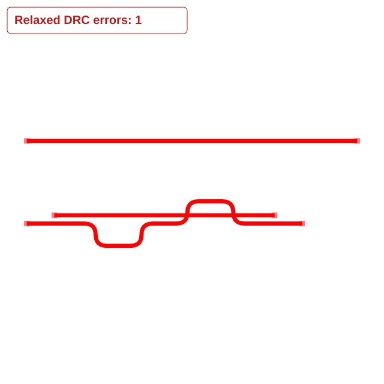
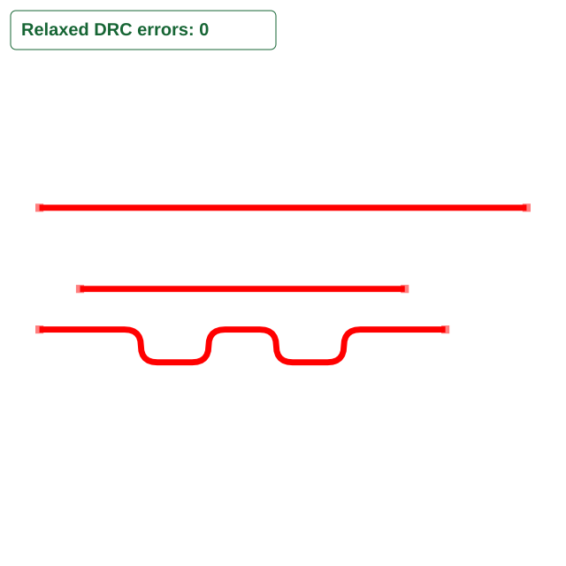

# Pipeline 9 length matching respects preloaded copper

The reproduction in [PR #2698](https://github.com/tscircuit/tscircuit-autorouter/pull/2698) showed a clean board becoming unsafe during length matching. Two new top-layer bus connections have lengths 10 mm and 12 mm and a maximum skew of 0.1 mm. An existing 8 mm wire lies beside the shorter connection. All six terminals have real pads.

The matcher previously received ordinary obstacles but omitted existing copper. Pipeline 9 now supplies obstacles derived from the latest repaired preloaded wires and vias. Rotated wire rectangles are approximated for the axis-aligned matcher, including round wire ends. The change applies to bus and differential-pair length matching.

## Tight placement: rejected, no unsafe output

With preloaded copper at y = 0.3 mm, the matcher exhausts its segment/tooth combinations. The pipeline propagates that error, reports failure rather than success, and refuses output. This is a safe rejection, not a newly solved board and not proof that no geometric solution exists. The snapshot explicitly shows the clean geometry before length matching; no final routed board is published.



## Roomier placement: successful, clear length-matched output

With preloaded copper at y = 1 mm, the meander stays away from existing copper. The final board passes default relaxed DRC including continuity, preserves the preloaded trace, and meets the 0.1 mm bus skew limit. The snapshot's DRC count is calculated from the actual output.



## Regression tests

The feature test is now an ordinary `test`, with the reproduction's `test.failing` marker removed. It asserts the tight-case rejection and the roomier case's successful output, DRC, trace preservation, and skew. The separate snapshot test verifies the corresponding images and output states.

```sh
bun test --timeout 9999999 tests/features/pipeline9-length-matching-preloaded-clearance.test.ts tests/repro/pipeline9-length-matching-preloaded-clearance.test.ts
```

Validation: eight focused tests pass (60 assertions), and `bunx tsc --noEmit --pretty false` passes. The checks also cover differential-pair clearance/options, preloaded power expansion, trace-to-obstacle conversion, and multipoint bus widths. This fixes missing matcher obstacle input; it does not add a general final-board DRC stage or prove the entire algorithm correct.
